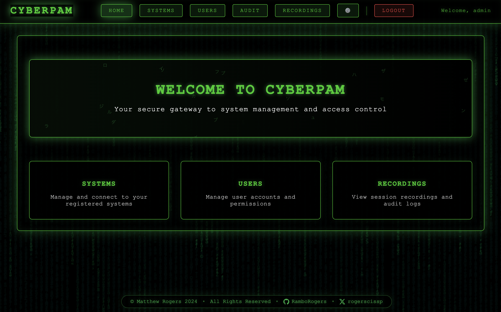
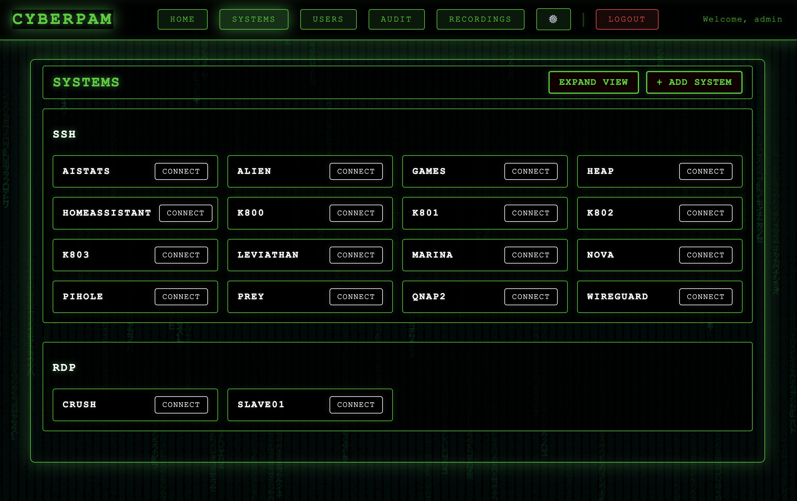
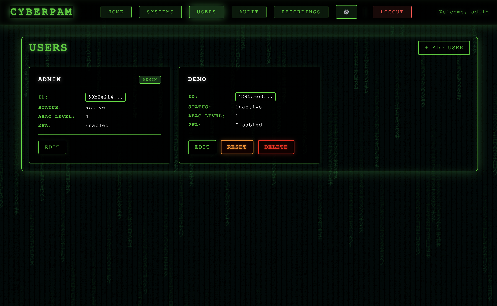

<p align="center">
<table align="center">
  <tr>
    <td align="center" width="50%"><strong>Session Recording</strong></td>
  </tr>
  <tr>
    <td align="center"></td>
  </tr>
</table>

<div align="center">
  <h1>CyberPAM</h1>
  <p><strong>Zero Trust Privileged Access Management</strong></p>
  <p>🔐 Zero Trust | 🎥 Session Recording | 🌐 Multi-Protocol | 🔒 ABAC Security | 🎨 Beautiful UI</p>
  <p>
    
    
    
    
  </p>
</div>

CyberPAM is a comprehensive Zero Trust Privileged Access Management solution designed for secure access to Windows, UNIX systems, and web applications. With its beautiful dark-themed interface and robust security features, it provides enterprise-grade access control and session monitoring capabilities.

I made CyberPAM for my own use, but I'm happy to share it with the community. I've been working with PAM products for years and CyberPAM is the culmination of my experience.  Session recording is a must have for any PAM product, and CyberPAM is the best I've seen from an Admin perspective, and user experience. Often implementations of PAM products take a long time to get to production, but not CyberPAM.

What is PAM? <a href="https://en.wikipedia.org/wiki/Privileged_access_management">PAM</a> is the process of managing access to resources. It is a critical component of any security architecture.

<p align="center"> <b>⚡️ This is a SINGLE CONTAINER and can go from pull to production in 5 minutes 🚀</b> </p>


## 🌟 Features

<table style="width:100%; border-collapse: collapse;">
  <tr>
    <td style="vertical-align: top; padding: 10px; border: 1px solid #ddd;">
      <h3 style="margin-top: 0;">Security & Access Control</h3>
      <ul style="list-style-type: none; padding-left: 0;">
        <li>🔒 Zero Trust Architecture with ABAC</li>
        <li>🔑 Multi-factor authentication with mandatory TOTP</li>
        <li>🔍 Granular access control with 4 security levels</li>
        <li>📝 Comprehensive audit logging for compliance</li>
        <li>🎥 Session recording with video playback</li>
        <li>🔐 Password complexity enforcement</li>
      </ul>
    </td>
    <td style="vertical-align: top; padding: 10px; border: 1px solid #ddd;">
      <h3 style="margin-top: 0;">Protocol Support with Session Recording</h3>
      <ul style="list-style-type: none; padding-left: 0;">
        <li>🖥️ RDP (Remote Desktop Protocol)</li>
        <li>🔗 SSH (Secure Shell)</li>
        <li>🌐 HTTP/HTTPS (planned)</li>
      </ul>
    </td>
  </tr>
  <tr>
    <td style="vertical-align: top; padding: 10px; border: 1px solid #ddd;">
      <h3 style="margin-top: 0;">Session Recording</h3>
      <ul style="list-style-type: none; padding-left: 0;">
        <li>📹 Full video recording of all sessions</li>
        <li>🔄 Automatic video conversion</li>
        <li>🔒 Secure storage management</li>
        <li>⏱️ Playback controls with timeline</li>
        <li>⬇️ Download capabilities</li>
        <li>🔐 Access control based on ABAC levels</li>
      </ul>
    </td>
    <td style="vertical-align: top; padding: 10px; border: 1px solid #ddd;">
      <h3 style="margin-top: 0;">User Management</h3>
      <ul style="list-style-type: none; padding-left: 0;">
        <li>👤 Local user authentication</li>
        <li>🔑 Role-based access control</li>
        <li>🔒 TOTP (2FA) requirement</li>
        <li>🔐 Password complexity rules</li>
        <li>🕒 Session management</li>
        <li>🚫 Failed attempt tracking</li>
      </ul>
    </td>
  </tr>
  <tr>
    <td style="vertical-align: top; padding: 10px; border: 1px solid #ddd;">
      <h3 style="margin-top: 0;">Beautiful Interface</h3>
      <ul style="list-style-type: none; padding-left: 0;">
        <li>🌑 Dark-themed modern UI</li>
        <li>🖥️ Matrix-style animations</li>
        <li>📱 Responsive design</li>
        <li>🔗 Protocol-based grouping</li>
        <li>🔑 Role-based navigation</li>
        <li>🖼️ Enhanced modals</li>
      </ul>
    </td>
    <td style="vertical-align: top; padding: 10px; border: 1px solid #ddd;">
      <h3 style="margin-top: 0;">Cloudflare Zero Trust Support Built in</h3>
      <ul style="list-style-type: none; padding-left: 0;">
        <li>🔒 Enhanced security with identity-based access</li>
        <li>🌐 Secure access to internal applications without VPN</li>
        <li>🛡️ Protection against data breaches and cyber threats</li>
        <li>🔍 Continuous monitoring and logging of user activity</li>
        <li>🔑 Multi-factor authentication (MFA) enforcement</li>
        <li>📊 Detailed access control policies and reporting</li>
        <li>🚀 Simplified user experience with seamless access</li>
      </ul>
    </td>
  </tr>
</table>

## 🚀 Quick Start

CyberPAM is distributed as a Docker container for easy deployment and a 5 minute setup:

 *You can just copy paste this into your terminal 🖥️ to deploy or upgrade*
```bash
# Pull the latest image
docker pull mattrogers/cyberpam:latest

docker stop cyberpam
docker rm cyberpam

# Run with basic configuration
docker run -d \
  --name cyberpam \
  -v cyberpamdb:/data \
  -v cyberpamrecordings:/recordings \
  -p 8080:8080 \
  mattrogers/cyberpam:latest

docker logs cyberpam
```

> *As of 0.1.1c, the container was designed to user docker volumes for persistence. You could also use a bind mount to the same effect.*

## ⚡️NOTICE - GET YOUR ADMIN PASSWORD👋

Access the web interface at `http://localhost:8080` after starting the container. The initial admin credentials will be displayed in the container logs:

```bash
# View initial admin credentials
docker logs cyberpam
```


### 📂 External Recordings Storage

```
# Run with external recordings storage
docker run -d \
  --name cyberpam \
  -p 8080:8080 \
  -v /your/local/path:/recordings \
  mattrogers/cyberpam:latest
```

The `/recordings` volume binding is optional but recommended for:
- Persistent storage of session recordings outside the container
- Easy access to recording files for backup
- Sharing recordings between container recreations
- Integration with external video processing tools


## 🔧️ Security Notice

CyberPAM is designed to be deployed behind a reverse proxy that handles SSL/TLS termination and additional security controls. We recommend:

### SSL/TLS Termination
Use a reverse proxy like Caddy (recommended), Nginx, or Traefik to handle HTTPS:

```bash
# Example Caddyfile configuration
cyberpam.yourdomain.com {
    reverse_proxy localhost:8080
}
```

### Zero Trust Network Access
We strongly recommend placing CyberPAM behind a Zero Trust solution such as:
- Cloudflare Zero Trust
- Zscaler Private Access
- Palo Alto Prisma Access

This ensures:
- Identity-based access control
- DDoS protection
- WAF capabilities
- Additional authentication layer
- Network isolation

### Example Architecture
```
Internet -> Cloudflare Zero Trust -> Reverse Proxy (TLS/Cloudflared) -> CyberPAM Container
```

## 🔒 First Time Setup


1. Start CyberPAM
2. Note the initial admin credentials displayed
3. Log in as admin
4. Change password and set up TOTP
5. Begin adding systems and users

## 🎯 Use Cases

- **Privileged Access Management**: Secure access to critical systems
- **Session Monitoring**: Record and audit all user sessions
- **Compliance**: Meet regulatory requirements with comprehensive logging
- **Zero Trust Implementation**: Enforce least-privilege access
- **Remote Access**: Secure remote system management

### Screenshots

<div align="center">
  <table>
    <tr>
      <td></td>
      <td></td>
    </tr>
    <tr>
      <td></td>
      <td></td>
    </tr>
    <tr>
      <td></td>
      <td></td>
    </tr>
    <tr>

<td colspan="2"></td>
    </tr>
  </table>
</div>


## Version CyberPam 0.2.0c
- Added Zero Trust Network Access from Cloudflare Support
- Added many missing features, like user reset
- Reworkeded more GUI styling inconsistencies
- Enhanced audit log interface with improved readability and filtering
- Added CSV export functionality for audit logs
- Improved system management interface with expanded/compact views
- Added cyberpunk-themed confirmation dialogs and modals
- Enhanced system deletion process with animated feedback
- Added system name display in recordings view
- Improved date/time formatting in recordings view
- Added version display in settings page
- Enhanced navbar consistency across all pages
- Improved admin status handling and security checks
- Added Cloudflare IP support for better security logging
- Enhanced error handling and user feedback
- Improved mobile responsiveness across all views
- Removed sensitive data from the audit log

## Version CyberPam 0.1.1c

***Please keep the issues and enhancement requests coming!***

- New Recording UI (with status and storage)
  - Fixes issues with transcoding (was scripted)
  - Event driven transcoding with nice UI
- Added SSH Key Authentication
- Added more fonts (bugfix)
- Reworked container storage (db persistence)
  - Allows for easier upgrades and backups
- GUI Improvements and Refactoring


<div align="center">

## ⚖️ License

<p>
CyberPAM is licensed under a restricted license.<p><i> (c)Matthew Rogers 2024. All rights reserved. No Warranty. No Support. No Liability. No Refunds.</p<br>
</i><p>
<em>Free Demo Software</em>
</p>

### Connect With Me 🤝

[](https://github.com/matthewrogers)
[](https://x.com/rogerscissp)
[](https://matthewrogers.org)


</div>


