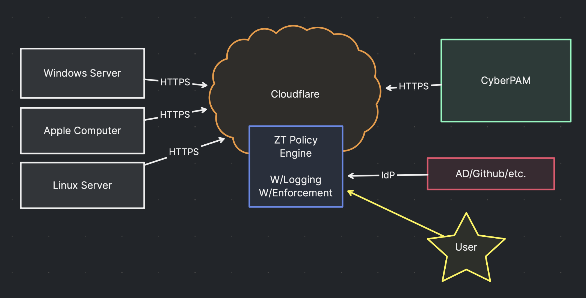
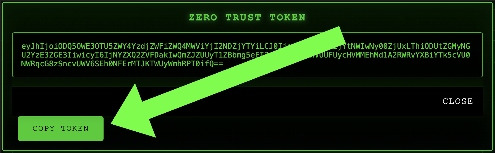

# CyberPAMZero Trust Network Access

TLDR: No more VPNs, just use Cloudflare Access to access your CyberPAM instance. Hosts no longer need to be in the same network, or have <b>any open ports.</b>

> Yes, CyberPAM and the host do NOT need to be in the same network.




## Setup Requirements

- Assumes you have a CyberPAM instance running already.
- Assumes you have a Cloudflare account and a domain. (free tier is fine)

## Settings Panel Fully Configured

When you having it it all setup, you should see something like this, notice the green globes.  This setup takes less than 15 minutes to complete.

> 💣 Notice red panel, once you set your domain, if you change it you will need to re-register the agents.


## Cloudflare ZTNA


>*The ZTNA module here works amazing well, however the setup isn't foolproof. Fill in the values and press save, then enable and the engine will start.*


### Add Catchall Policy

You need this policy to secure your hosts, and allow access to your CyberPAM instance.


### Get your Service Token

You'll need to strip off the CF-Header and CF-Key from the token, and then paste it into the CyberPAM settings panel.


### Setup API Access
Take note of the API key, account id, and email, you'll need to paste them into the CyberPAM settings panel. Your permissions should match these here.


You'll know its working when you see the green globe and your domains populate.

> If you don't see the green globes or the domains don't populate, you'll need to check your API key, account id, and email.


## Add Hosts

Lets add a host to our CyberPAM instance.




Run the CyberPAM agent on the host, and provide this token. Within a few minutes you should see the host will be added to the list and the tunnel will show it's health under "expanded" view.

https://github.com/RamboRogers/cyberpamagent

### 🐧 Linux & 🍎 macOS

```bash
curl -L https://raw.githubusercontent.com/RamboRogers/cyberpamagent/main/install.sh | sh
```

### 🪟 Windows PowerShell
> *Admin Powershell*
```powershell
iwr -useb https://raw.githubusercontent.com/RamboRogers/cyberpamagent/main/install.ps1 | iex
```


That's it, the agent will install and run as a service. You can uninstall it with `cyberpamagent -uninstall`.

## Lots of Hosts

A example instance with some hosts added.


<div align="center">

## ⚖️ License

<p>
CyberPAM is licensed under a restricted license.<p><i> (c)Matthew Rogers 2024. All rights reserved. No Warranty. No Support. No Liability. No Refunds.</p<br>
</i><p>
<em>Free Demo Software</em>
</p>

### Connect With Me 🤝

[](https://github.com/matthewrogers)
[](https://x.com/rogerscissp)
[](https://matthewrogers.org)


</div>